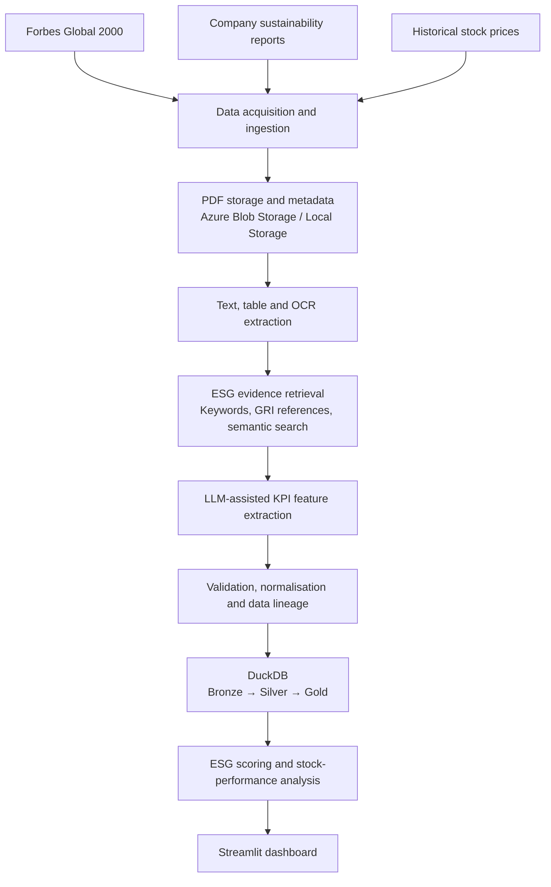
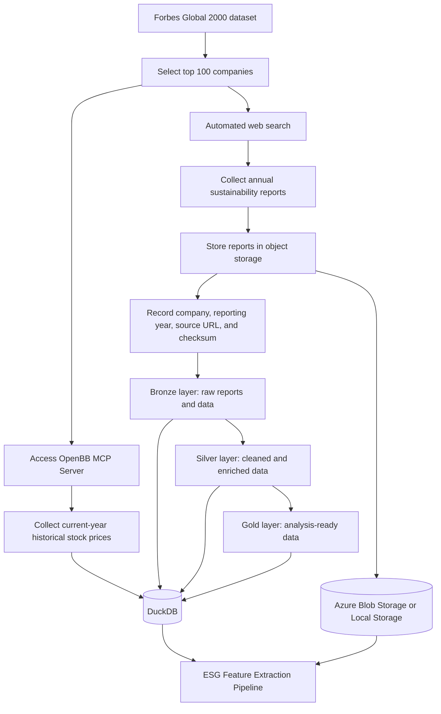
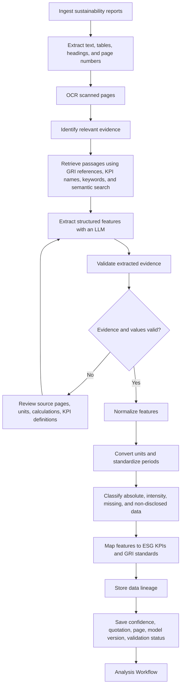
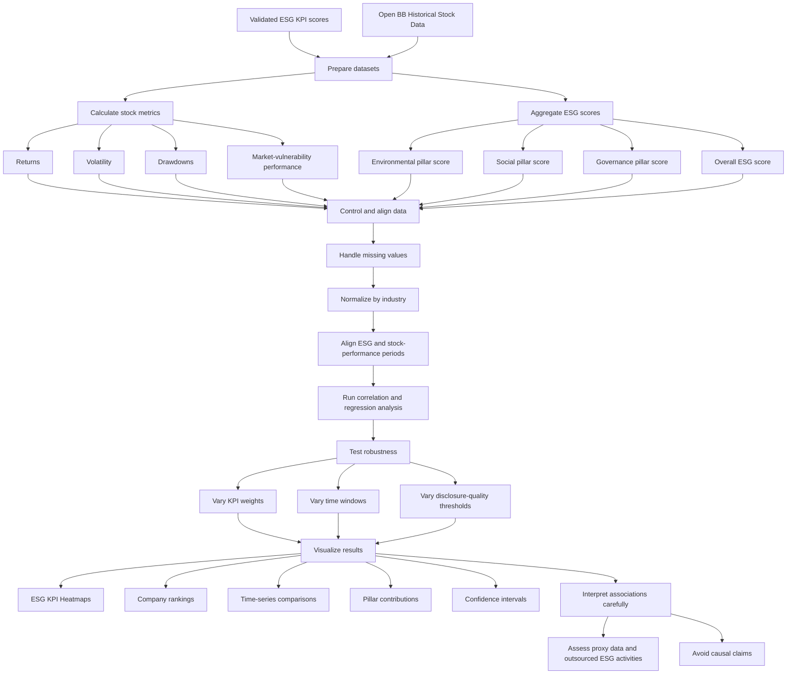

## Overview
- [High-Level Architecture](#high-level-architecture)
- [Data Ingestion Pipeline](#data-ingestion-pipeline)
- [ESG Feature Extraction Pipeline](#esg-feature-extraction-pipeline)
- [Analysis Workflow](#analysis-workflow)

 

## High-Level Architecture

## Data Ingestion Pipeline

## ESG Feature Extraction Pipeline

## Analysis Workflow

